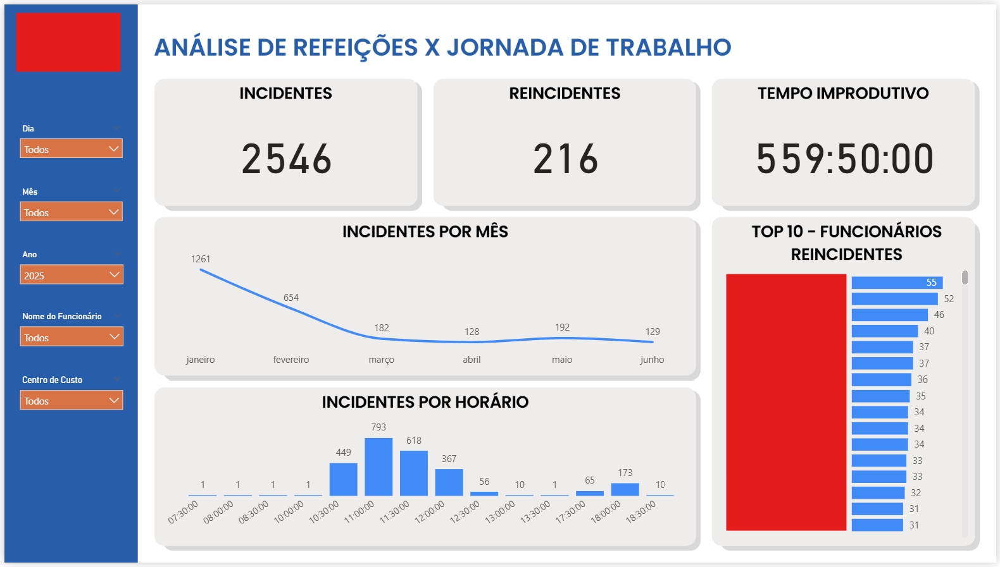
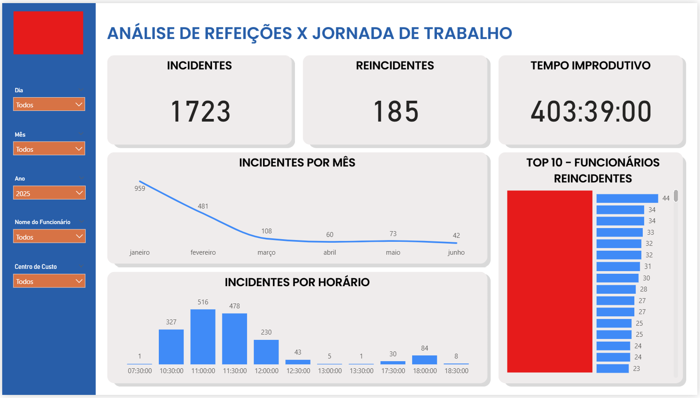

# 📊 Meals vs Work Shift Analysis (HR)

## 🔍 Context
This project was developed to support HR teams in identifying meals taken
during working hours, in violation of the mandatory 1-hour break period.

---

## 🎯 Objective
- Identify meal incidents during working hours
- Detect recurrent employees
- Measure unproductive time
- Support HR decision-making

---

## 📊 Dashboards

### 🔎 Dashboard — Without Filters

---

### 🎯 Dashboard — With Filters

